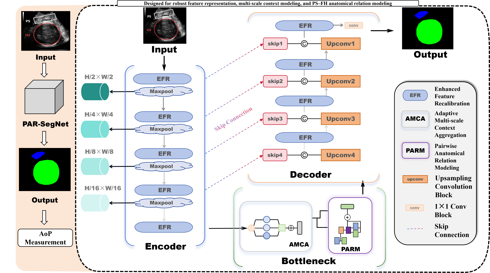

# PAR-SegNet
## Architecture

**Official implementation of PAR-SegNet: Pairwise Anatomical Relation Modeling Network for Fetal Head and Pubic Symphysis Segmentation in Intrapartum Ultrasound.**

## Overview

PAR-SegNet is a deep learning framework for simultaneous segmentation of the fetal head (FH) and pubic symphysis (PS) in intrapartum ultrasound images. The network incorporates lightweight feature recalibration, multi-scale context aggregation, and pairwise anatomical relation modeling to improve segmentation accuracy and facilitate Angle of Progression (AoP) estimation.

The framework consists of three main components:

* **EFR (Enhanced Feature Recalibration):** lightweight feature recalibration for improving the reliability of task-relevant features.
* **AMCA (Adaptive Multi-scale Context Aggregation):** captures contextual information at multiple spatial scales.
* **PARM (Pairwise Anatomical Relation Modeling):** explicitly models the anatomical relationship between the fetal head and pubic symphysis.

